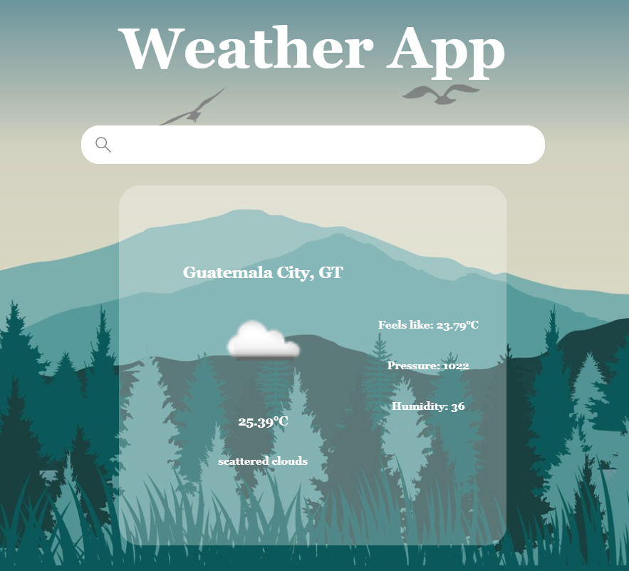

# weather App
 This website was build using django as a back-end and html/css as front-end.
 
# To run on windows
1. Clone project
2. Open cmd
3. Navigate to the location of the cloned project
4. Execute python manage.py runserver
4. In your preferred in your preferred search engine search http://127.0.0.1:8000/
 
# Contributors
<a href="https://github.com/Sebasssiu">Sebasssiu</a>

